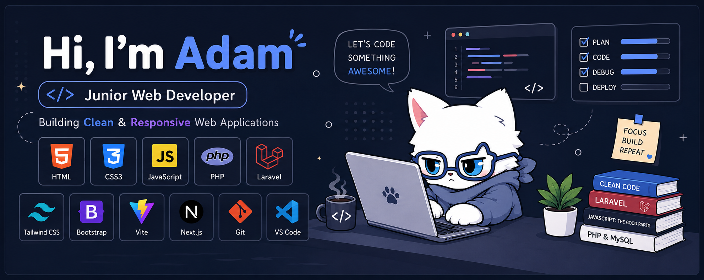

<p align="center">
  
</p>

<h1 align="center">✨ Hello World, I'm Adam Zhafran 👋</h1>

<p align="center">
  <a href="https://github.com/DamFran">
    
  </a>
</p>

---

### 🚀 About Me

<table border="0" cellspacing="0" cellpadding="0">
  <tr>
    <td width="60%" valign="top">
      <p>I am a passionate <b>Junior Web Developer</b> focused on building clean, responsive, and highly functional web applications. I love turning complex logic into simple, beautiful, and intuitive designs.</p>
      <p>Currently, I am diving deep into the <b>Laravel ecosystem</b> and advanced backend development to build robust APIs and scalable applications.</p>
      <p><i>Fun fact: I love cat. (No shi, Sherlock)</i></p>
    </td>
    <td width="40%" align="center" valign="middle">
      
    </td>
  </tr>
</table>

```javascript
const developer = {
  name: "Adam Zhafran",
  role: "Junior Web Developer",
  skills: ["HTML", "CSS", "JavaScript", "Laravel", "React", "Next.js"],
  currentlyLearning: ["Advanced Laravel", "REST API", "Database Optimization"],
  passion: "Creating clean, scalable, and user-centric digital experiences",
};
```

---

## ⚡ Tech Stack & Tools

<table border="0">
  <tr>
    <td valign="top" width="33%">
      <h4>🌐 Frontend</h4>
      <a href="https://skillicons.dev">
        
      </a>
    </td>
    <td valign="top" width="33%">
      <h4>⚙️ Backend & DB</h4>
      <a href="https://skillicons.dev">
        
      </a>
    </td>
    <td valign="top" width="33%">
      <h4>🛠️ Tools & DevOps</h4>
      <a href="https://skillicons.dev">
        
      </a>
    </td>
  </tr>
</table>

---

## 🚀 Featured Project

### 🏛️ LaporWarga — _Civic Engagement & Response System_

<p align="left">
  
  
  
</p>

A modern digital platform built to bridge the gap between citizens and local government. It allows residents to easily report public issues and enables officials to manage, track, and resolve them transparently in real-time.

- **✨ Seamless Reporting:** Citizens can submit complaints with descriptions, categories, and locations.
- **📊 Interactive Dashboard:** Administrative panel with data analytics, mapping, and report status tracking.
- **📱 Responsive & Fluid UI:** Styled with Tailwind CSS and powered by React for a fast, modern single-page experience.

---

## 📈 GitHub Stats & Activity

<p align="center">
  <a href="https://github.com/DamFran">
    
  </a>
</p>

---

## 🤝 Let's Connect & Collaborate

I'm always open to discussing new projects, collaboration opportunities, or entry-level web developer roles!

<p align="center">
  <!-- Email link with your pre-populated email -->
  <a href="mailto:adamzhafran999@gmail.com">
    
  </a>
  
  <!-- LinkedIn link - replace URL if your LinkedIn profile URL is different -->
  <a href="https://linkedin.com/in/adamzhafran" target="_blank">
    
  </a>
  
  <!-- Instagram link - replace URL if your Instagram username is different -->
  <a href="https://instagram.com/adamzhafran_" target="_blank">
    
  </a>
</p>

---

<p align="center">
  <br />
  <i>"First, make it work. Then, make it clean. Then, make it fast."</i>
  <br />
  <b>— Kent Beck</b>
</p>
